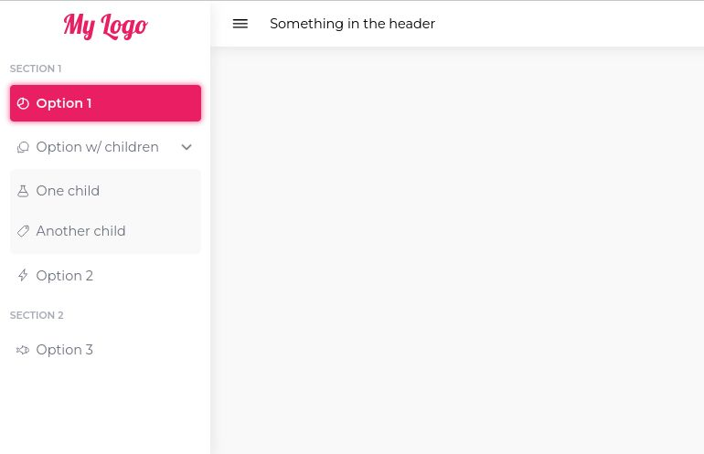
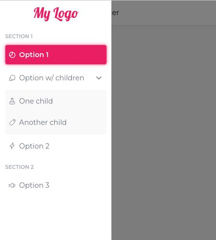

# dashboard-layout-vue
Vue 3 basic responsive layout for admin dashboards.



> ## Disclaimer
> I'm a beginner and this layout is mostly for my own use.  
> Work in progress  
> I probably won't be looking at issues, but you're free to fork and modify as you wish.

# Setup
Requires
- Vue 3
- IonIcons

1. Add IonIcons [as described on their website](https://ionic.io/ionicons/usage). Example:
```html
<script type="module" src="https://unpkg.com/ionicons@5.5.2/dist/ionicons/ionicons.esm.js"></script>
<script nomodule src="https://unpkg.com/ionicons@5.5.2/dist/ionicons/ionicons.js"></script>
```

2. Include in `main.js`
```javascript
import { createApp } from 'vue'
import App from './App.vue'
import DashboardLayout from 'dashboard-layout-vue' // <-- This
import 'dashboard-layout-vue/styles.css' // <-- This

const app = createApp(App);
app.use(DashboardLayout) // <-- This

app.mount('#app')

```


# Example usage
```html
<script setup>
import { computed } from 'vue'
import { useRouter, useRoute } from 'vue-router'
const router = useRouter()
const route = useRoute()

function handleClick(pageTo){
  router.push({ path: pageTo})
}

const currentRoute = computed(() => route.path)

</script>

<template>
  <DashboardLayout primaryColor="#E91E63" @buttonClicked="handleClick" :currentRoute="currentRoute">
    <template v-slot:sidebar-logo>
      <div class="logo">My Logo</div>
    </template>
    <template v-slot:header>
      Something in the header
    </template>
    <template v-slot:content>
    </template>    
  </DashboardLayout>
</template>
```

# Props
| Prop | Description | Example |
|--|--|--|
| `menu` | The menu | See below |
| `mobileBreakpoint` | Mobile breakpoint | `1024` |
| `backgroundColor` | Background color (the lightest) | `'#fff'` |
| `contentBackgroundShade` | Shading percentage for content container | `-0.05` |
| `currentRoute` | The current route from the `useRoute()` object | `'/app/option1'` |
| `primaryColor` | Brand color | `'#4361ee'` |
| `fontColor` | Font color | `'#494c5c'` |
| `sidebarWidth` | Width of the sidebar | `'16rem'` |


Example menu
```javascript
[
  {
    section: "Section 1",
    options: [
      {
        id: 'option1',
        displayText: "Option 1",
        to: "/app/option1",
        ionIcon: "pie-chart-outline"
      },
      {
        id: 'option-child',
        displayText: "Option With Child",
        ionIcon: "chatbubbles-outline",
        children: [
          { id: 'child', displayText: "Child Option", to: "/app/child", ionIcon: "pricetag-outline" },
        ],
      },
    ]
  },
  {
    section: "Section 2",
    options: [
      {
        id: 'option2',
        displayText: "Option 2",
        to: "/app/option2",
        ionIcon: "pie-chart-outline"
      }      
    ]
  },
]
```

# Slots
| Slot | Example |
|--|--|
| `header` | |
| `content` | |
| `sidebar-logo` | |


# Events
| Event | Description | Example Payload |
|--|--|--|
| `buttonClicked` | When an element from a sidebar is clicked | `'/app/option1'` |


Bye.